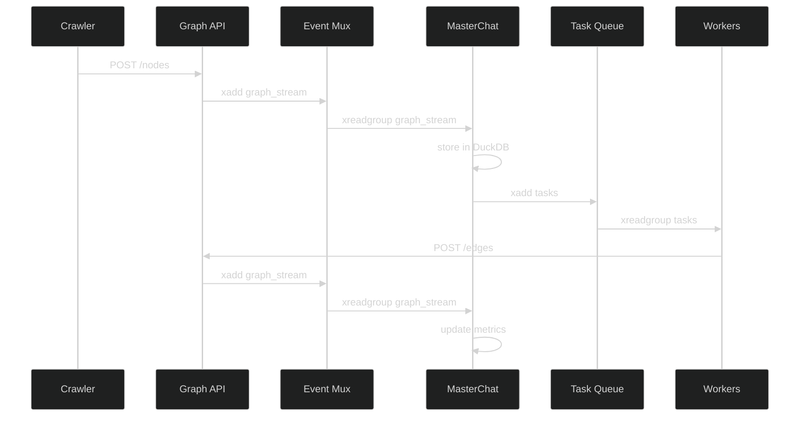

# Lumina Backend Current State

> _Last verified: 2024-03-19_

## Core Components

### 1. MasterChat Supervisor (`lumina_core/masterchat/main.py`)
- FastAPI-based supervisor service
- Intent routing and plan execution
- Streaming response support (SSE)
- Redis-based task queue
- Prometheus metrics integration
- Goal lattice-based planning
- DuckDB event storage
- Redis event ingestion
- Task dispatching
- Planner logs streaming

### 2. Ollama Bridge (`lumina_core/llm/ollama_bridge.py`)
- Environment-driven configuration (`OLLAMA_URL`, `OLLAMA_MODEL`)
- Streaming response support
- Token counting
- Error handling
- Async HTTP client with timeout

### 3. Memory System (`lumina_core/memory/qdrant_store.py`)
- Qdrant vector store integration
- Nomic embeddings (`nomic-ai/nomic-embed-text-v1`)
- Conversation tracking with UUIDs
- Similar message retrieval (top-3)
- Metrics collection

### 4. Embedding Cache (`lumina_core/utils/cache.py`)
- Two-level caching:
  - In-memory LRU cache
  - Optional Redis backend
- Configurable cache size
- 24-hour Redis expiry
- Error handling and logging

### 5. Rate Limiting (`lumina_core/utils/rate_limit.py`)
- Redis-backed token bucket implementation
- Per-agent rate limits:
  - CrawlAgent: 5 requests/minute
  - SummariseAgent: 10 requests/minute
  - QAAgent: 20 requests/minute
- Configurable limits via environment variables
- Graceful error responses with retry-after headers

### 6. MasterChat Agents
- CrawlAgent: Wikipedia article crawling
- SummariseAgent: Article summarization
- QAAgent: Question answering
- OrchestratorAgent: Task coordination and monitoring

### 7. Event Mux
- Redis event streaming
- WebSocket/SSE broadcasting
- Kafka integration (optional)
- Log forwarding
- Event enrichment

## API Endpoints

### MasterChat API
- `POST /masterchat/chat`
  - Intent routing
  - Plan execution
  - Streaming responses
  - Memory integration
  - Rate limiting
- `POST /masterchat/plan`
  - Goal lattice-based planning
  - Task orchestration
- `GET /masterchat/health`
  - Service health checks
  - Metrics summary
- `GET /planner/logs`
  - SSE stream of planner logs
  - Real-time planning updates
- `POST /tasks`
  - Task submission
  - Crawl configuration
  - Node limits

### Chat API
- `POST /chat`
  - Streaming responses
  - Memory integration
  - Token counting
  - Error handling
  - Rate limiting

### Metrics API
- `GET /metrics/summary`
  - Conversation count
  - Token usage
  - Vector count
  - Agent-specific metrics
  - Node growth tracking

### Health API
- `GET /health`
  - Deep service checks
  - Per-service status
  - Degraded state handling
  - Rate limit status

### OpenAI-Compatible API
- `POST /v1/chat/completions`
  - Streaming support
  - Token counting
  - Memory integration
  - Rate limiting
- `GET /v1/models`
  - Model listing

## Infrastructure

### Logging
- Structured logging with loguru
- JSON format for production
- Colorized format for development
- File rotation and compression
- Request/response logging
- Error context logging
- Agent-specific logging
- Planner logs streaming

### Rate Limiting
- Redis-backed token bucket
- Per-agent rate limits
- Protection against DoS
- Configurable limits
- Retry-after headers

### CORS
- Configurable origins
- Method and header support

### Alerting
- Prometheus alert rules for:
  - High latency (>5s)
  - Stalled node growth (>30m)
  - High error rates (>5%)
- Grafana dashboards
- Alert notifications

### Task Orchestration
- Redis-based task queue
- Goal lattice-based planning
- Agent coordination
- Task monitoring
- Error recovery
- Event ingestion
- DuckDB storage

### Event Processing
- Redis streams for events
- Consumer groups
- Event enrichment
- WebSocket/SSE broadcasting
- Kafka integration (optional)

## Testing

### Unit Tests
- Ollama bridge mocking
- Qdrant store mocking
- OpenAI compatibility
- Streaming responses
- Error handling
- Rate limiting
- Agent testing
- Orchestration testing
- Event processing

### Test Coverage
- Chat endpoints
- Memory operations
- OpenAI compatibility
- Health checks
- Metrics
- Rate limiting
- Alert rules
- Agent functionality
- Orchestration logic
- Event processing

## Environment Variables
```
REDIS_URL=redis://redis:6379/0
OPENAI_API_KEY=sk-xxxxx-or-blank
PLAN_CRON=*/10 * * * *
LLM_BUDGET_USD=0.05
OLLAMA_URL=http://llm-engine:11434
OLLAMA_MODEL=phi2
QDRANT_URL=http://qdrant:6333
EMBEDDING_CACHE_SIZE=1000
CRAWL_RATE_LIMIT=5/minute
SUMMARISE_RATE_LIMIT=10/minute
QA_RATE_LIMIT=20/minute
MISTRAL_API_KEY=your_api_key
MISTRAL_MODEL=mistral-medium
LLM_TEMP=0.3
GOAL_FILE=goal_lattice.yml

# Cypress environment (ui/cypress.env.json)
CYPRESS_baseUrl=http://localhost:3000
```

## Dependencies
```
fastapi>=0.104.0
uvicorn>=0.24.0
redis>=5.0.1
qdrant-client>=1.6.0
sentence-transformers>=2.2.2
pydantic>=2.4.2
python-dotenv>=1.0.0
httpx>=0.25.0
pytest>=7.4.0
pytest-asyncio>=0.21.0
loguru>=0.7.0
fastapi-limiter>=0.1.5
prometheus-client>=0.19.0
mistralai>=0.0.7
sse-starlette>=1.8.2
duckdb>=0.9.2
```

## Docker Compose Configuration
```yaml
services:
  masterchat:
    build: ./masterchat
    env_file: .env
    depends_on:
      redis:     { condition: service_healthy }
      graph-api: { condition: service_healthy }
      event-mux: { condition: service_healthy }
    ports: [ "8300:8000" ]
    healthcheck:
      test: ["CMD", "curl", "-f", "http://localhost:8000/health"]
      interval: 30s
    volumes:
      - master_state:/data

  event-mux:
    environment:
      - REDIS_URL=${REDIS_URL}
      - WS_PORT=8100
      - ENABLE_KAFKA=false

volumes:
  master_state:
```

## Usage Examples

### MasterChat CLI
```python
from masterchat import MasterChat

# Initialize client
client = MasterChat(
    base_url="http://localhost:8000",
    api_key="your_api_key"
)

# Start a chat session
response = await client.chat(
    message="What is the Mandelbrot set?",
    mode="wiki_qa"
)

# Stream response
async for chunk in response:
    print(chunk.content, end="")
```

### Task Submission
```bash
# Submit a crawl task
curl -X POST localhost:8300/tasks \
  -H 'Content-Type: application/json' \
  -d '{"crawl":["Mandelbrot set"],"hops":1,"max_nodes":30}'

# Monitor planner logs
curl localhost:8300/planner/logs
```

### OpenAI Client
```python
from openai import OpenAI

client = OpenAI(
    base_url="http://localhost:8000/v1",
    api_key="dummy"
)

# Streaming
stream = client.chat.completions.create(
    model="phi2",
    messages=[{"role": "user", "content": "Hello!"}],
    stream=True
)
for chunk in stream:
    if chunk.choices[0].delta.content:
        print(chunk.choices[0].delta.content, end="")

# Non-streaming
response = client.chat.completions.create(
    model="phi2",
    messages=[{"role": "user", "content": "Hello!"}]
)
print(response.choices[0].message.content)
```

### LangChain
```python
from langchain.chat_models import ChatOpenAI
from langchain.schema import HumanMessage

chat = ChatOpenAI(
    openai_api_base="http://localhost:8000/v1",
    model_name="phi2"
)

messages = [HumanMessage(content="Hello!")]
response = chat(messages)
print(response.content)
```

## Running the Service

### Development
```bash
uvicorn lumina_core.masterchat.main:app --reload
```

### Production
```bash
REDIS_URL=redis://redis:6379/0 \
OPENAI_API_KEY=sk-xxxxx-or-blank \
PLAN_CRON=*/10 * * * * \
LLM_BUDGET_USD=0.05 \
EMBEDDING_CACHE_SIZE=1000 \
CRAWL_RATE_LIMIT=5/minute \
SUMMARISE_RATE_LIMIT=10/minute \
QA_RATE_LIMIT=20/minute \
MISTRAL_API_KEY=your_api_key \
MISTRAL_MODEL=mistral-medium \
LLM_TEMP=0.3 \
GOAL_FILE=goal_lattice.yml \
uvicorn lumina_core.masterchat.main:app --host 0.0.0.0 --port 8000
```

## Next Steps
1. Vector pruning job for Qdrant maintenance
2. Enhanced error handling and retries
3. Metrics aggregation and visualization
4. Load testing and performance optimization
5. Documentation and API examples
6. Alert rule tuning based on production data
7. Rate limit optimization based on usage patterns
8. Goal lattice refinement
9. Agent coordination improvements
10. Task monitoring enhancements
11. Event processing optimization
12. Kafka integration (if needed)
13. Frontend integration improvements
14. Planner log visualization
15. DuckDB query optimization 

## System Architecture

### Event Flow Sequence


### Health Check Matrix
| Service | Endpoint | Expected Response |
|---------|----------|-------------------|
| hub-api | [http://localhost:8000/health](http://localhost:8000/health) | `{"redis":"ok","qdrant":"ok","ollama":"ok","scheduler":"ok"}` |
| graph-api | [http://localhost:8001/metrics?ready=1](http://localhost:8001/metrics?ready=1) | `{"status":"ok"}` |
| event-mux | [http://localhost:8100/health](http://localhost:8100/health) | `{"status":"ok","streams":["graph_stream","tasks"]}` |
| masterchat | [http://localhost:8300/health](http://localhost:8300/health) | `{"planner_alive":true,"redis":"ok","duckdb":"ok"}` |
| vector-db | [http://localhost:6333/health](http://localhost:6333/health) | `{"status":"ok"}` |
| llm-engine | [http://localhost:11434/api/health](http://localhost:11434/api/health) | `{"status":"ok"}` |

### Stream Naming Conventions
```yaml
streams:
  graph_stream/v1:  # Node/edge events
    group: masterchat
    consumer: mc
    maxlen: 10000
  tasks/v1:         # Task queue
    group: workers
    consumer: worker-1
    maxlen: 10000
  planner_log/v1:   # Planning events
    group: ui
    consumer: frontend
    maxlen: 1000
```

## Environment Variables
```env
# Minimal .env for local development
REDIS_URL=redis://redis:6379/0
OPENAI_API_KEY=sk-xxxxx-or-blank
PLAN_CRON=*/10 * * * *
LLM_BUDGET_USD=0.05

# Cypress environment (ui/cypress.env.json)
CYPRESS_baseUrl=http://localhost:3000
```

## Smoke Test
```bash
#!/bin/bash
# scripts/smoke.sh

# Start services
echo "Starting services..."
docker compose up -d

# Wait for health
echo "Waiting for services to be healthy..."
until curl -s http://localhost:8300/health | grep -q "planner_alive.*true"; do
    sleep 2
done

# Submit crawl task
echo "Submitting crawl task..."
curl -X POST http://localhost:8300/tasks \
    -H 'Content-Type: application/json' \
    -d '{"crawl":["Mandelbrot set"],"hops":1,"max_nodes":30}'

# Check event-mux logs
echo "Checking event-mux logs..."
timeout 30s docker logs -f event-mux | grep -q "node.add"

# Verify DuckDB state
echo "Verifying DuckDB state..."
NODE_COUNT=$(docker compose exec masterchat duckdb /data/state.db "SELECT COUNT(*) FROM events WHERE type = 'node.add' AND ts > now() - 300")
if [ "$NODE_COUNT" -gt 0 ]; then
    echo "✅ Smoke test passed!"
    exit 0
else
    echo "❌ Smoke test failed!"
    exit 1
fi
```

## CI Integration
```yaml
# .github/workflows/ci.yml
name: CI

on:
  push:
    branches: [ main ]
  pull_request:
    branches: [ main ]

jobs:
  smoke:
    runs-on: ubuntu-latest
    steps:
      - uses: actions/checkout@v3
      - name: Run smoke test
        run: ./scripts/smoke.sh
      - name: Update last verified
        run: |
          sed -i "s/Last verified: .*/Last verified: $(date +%Y-%m-%d)/" backcurrentstate.md
        if: github.ref == 'refs/heads/main'
```

## End-to-End Testing
See `ui/cypress/e2e/happy_path.cy.ts` for the canonical UI test suite. Tests respect `CYPRESS_baseUrl` from `ui/cypress.env.json`.

## DuckDB Query Cheat Sheet
```sql
-- Recent events by type
SELECT type, COUNT(*) 
FROM events 
WHERE ts > now() - 3600 
GROUP BY type;

-- Node growth rate
SELECT 
    date_trunc('hour', ts) as hour,
    COUNT(*) as nodes_added
FROM events 
WHERE type = 'node.add'
GROUP BY hour
ORDER BY hour DESC;

-- Task completion rate
SELECT 
    date_trunc('hour', ts) as hour,
    COUNT(*) as tasks_completed
FROM events 
WHERE type = 'task.complete'
GROUP BY hour
ORDER BY hour DESC;

-- Error rate by agent
SELECT 
    agent,
    COUNT(*) as error_count
FROM events 
WHERE type = 'error'
    AND ts > now() - 3600
GROUP BY agent
ORDER BY error_count DESC;
```

## Quick Commands
```bash
# Query DuckDB directly
docker compose exec masterchat duckdb /data/state.db

# Run Cypress tests
cd ui && CYPRESS_baseUrl=http://localhost:3000 npx cypress run

# Check service logs
docker compose logs -f [service]
``` 